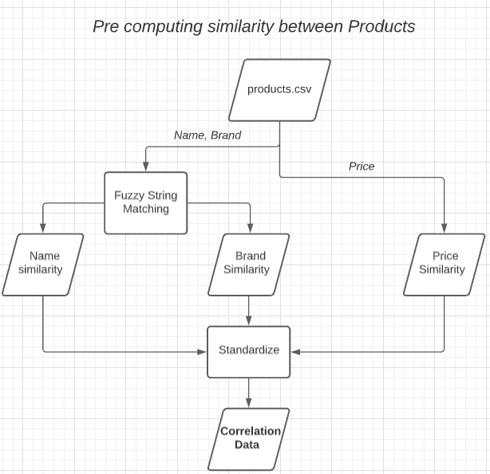
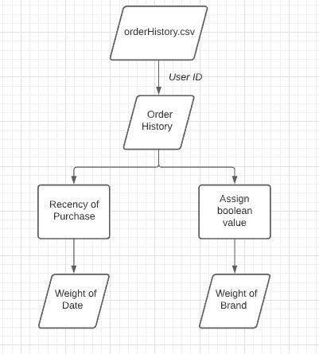
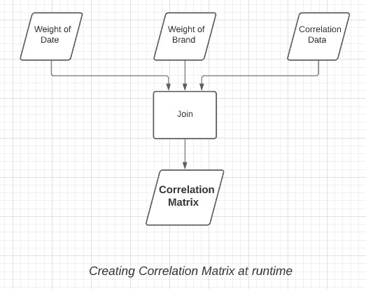
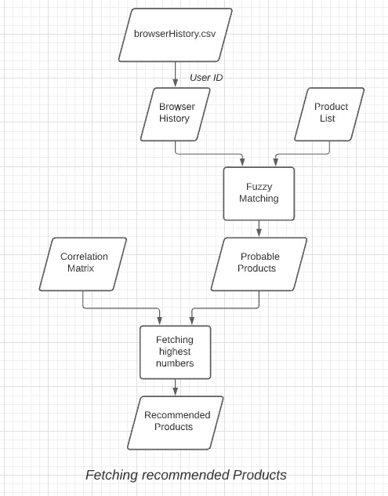

# Backend
## Algorithm

**The algorithm presented here is not the exact same as we presented in the last round, but has improvisations regarding scalibility, speed and better recommendations**

The algorithm used in creating recommendations for the user, using already availabe data, is explained in this section, with the help of different block diagrams. 

A high level overview of the algorithm used would be as follows:
1) A set of attributes would be used to pre compute similarity amongst different products. These include: 
    * The price of the products
    * The name of the products
    * The brand of the products

    

2) A user logging in would have an ID mapped, which would be used to fetch his specific Order History and Browse History. 
3) Using the Order History, the data of that user is used to create another set of attributes. The new attributes include:
    * The date of ordering of his previous items
    * The brand preference of the user 

     

4) All of this data is clubbed together into a (Products X Attributes) Matrix. We then find its Correlation Matrix.
5) Using the correlation matrix, we get information about which product is the most linked to another set of products.

     

6) Now, using the browse queries of the user, we find possible products using a simple application of Levenshtein Distance (or edit distance). We create a list of possible products the user was trying to search
7) Now, we have both the tools required to get the final recommendations, the possible products and the correlation matrix of the products.
8) The algorithm then finds the products most related to the products present in the Possible Products list, and a randomizer is used incase of a large quantity of products.
9) This would be the final recommmendations provided for the user, which are then relayed back to our front end.

     
