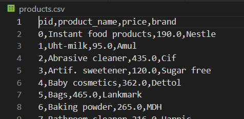
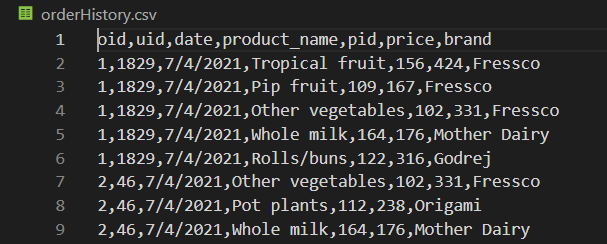
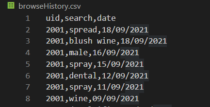
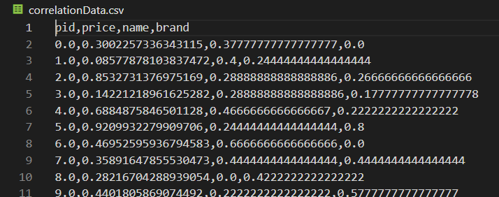

# Backend
## Datasets

As per the sample schema provided to us, and some further initiatives from our side, our current system employs the use of the following datasets: 
1) products.csv - Contains information of all the products available in the website.

     

2) orderHistory.csv - Contains information of all the previous orders of the entire user base of our website. Contains various attributes like date of order, products ordered etc.

    

3) browseHistory.csv - Contains information of all the browse history of the entire user base of our website. Contains  attributes like search query, date etc.

    

4) correlationData.csv - This is one of our own precomputed dataset. This includes information about the pre-computed attributes explained earlier, and is its data is used to create the correlation matrix.

    

Currently, these datasets are in a .csv format, stored on our backend server. For updations in the dataset, we had in mind a periodic-updation schedule for the datasets with fresh new data of every user order and browse history. Such scheduling would help in the system fetching new recommendations sooner, and without much interruption of any service.

As a further option, we also had in mind hosting these datasets on a provider like Firebase, or Mongo DB, where we can directly fire put,get and patch requests. This would be our first optimization on the path of scaling.