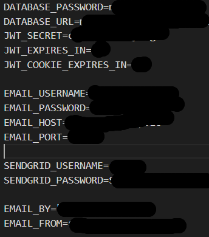

# Frontend

## Installation

1. Installation begins with cloning the github repository by using the following command in the terminal while in the directory you wish to install this project.

```
git clone https://github.com/namansingh73/smartGross.git
```

After the installation, you would see the following file structure in the text editor after opening the folder expect for the **node_modules, config.env, public, .cache** folders


2. Next step would be to install the required modules to be used in this project. Execute the following command in the terminal being in the root directory of the project.

```
npm i
```

3. Next, you need to configure the environment variables used in the project which are listed below along with their description
   

   > **DATABASE_PASSWORD** : Holds the password of the **MongoDB** database.
   >
   > **DATABASE_URL** :Contains the **URL** of database. Replace the word **"password"** with **"PASSWORD"** in the given URL.
   >
   > **JWT_SECRET** : Contains JWT secret string.
   >
   > **JWT_EXPIRES_IN** : Holds the time in which the JWT will expire.
   >
   > **JWT_COOKIE_EXPIRES_IN** : Holds the time in which the cookie holding the user details and **jwt** token will expire.
   >
   > **EMAIL_USERNAME** : Contains email username of **Mailtrap** which is being used to send mail to the user.
   >
   > **EMAIL_PASSWORD** : Holds email password of **Mailtrap** account.
   >
   > **EMAIL_HOST** : Contains information about email host of the email services being used in the project.
   >
   > **EMAIL_PORT** : Stores the port at which emails are being sent.
   >
   > **SENDGRID_USERNAME** : Stores username of the **Sendgrid** account.
   >
   > **SENDGRID_PASSWORD** : Stores password of the **Sendgrid** account.
   >
   > **EMAIL_BY** : Holds the name of the organization from which the emails are being sent.
   >
   > **EMAIL_FROM** : Stores the email address from which logged in users will receive the email.

4. Run the following command in the terminal being in the root directory for dynamic changing of static assests in the browser without needing to reload the page.

```
npm run start2
```

5. Now run this command in the separate terminal being in the root directory which shall start the server on localhost on the port 3000.

```
npm start
```

After the final step, the console should look something like


